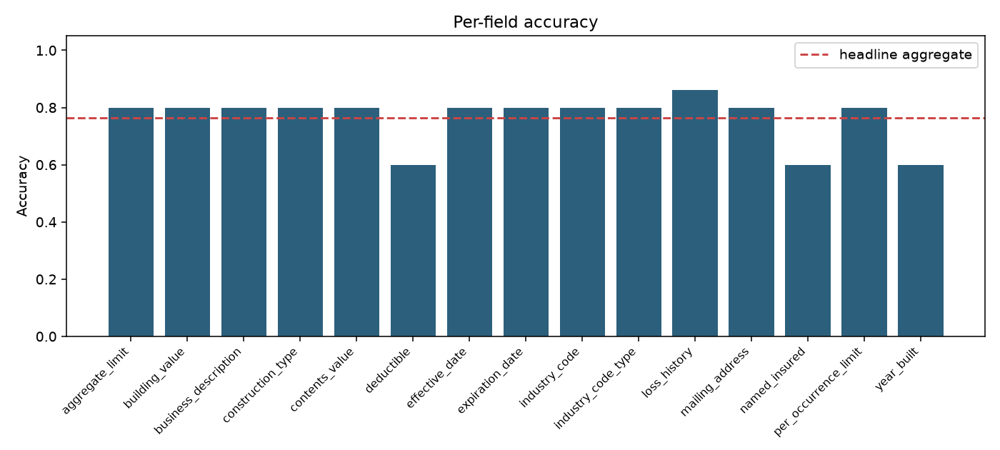
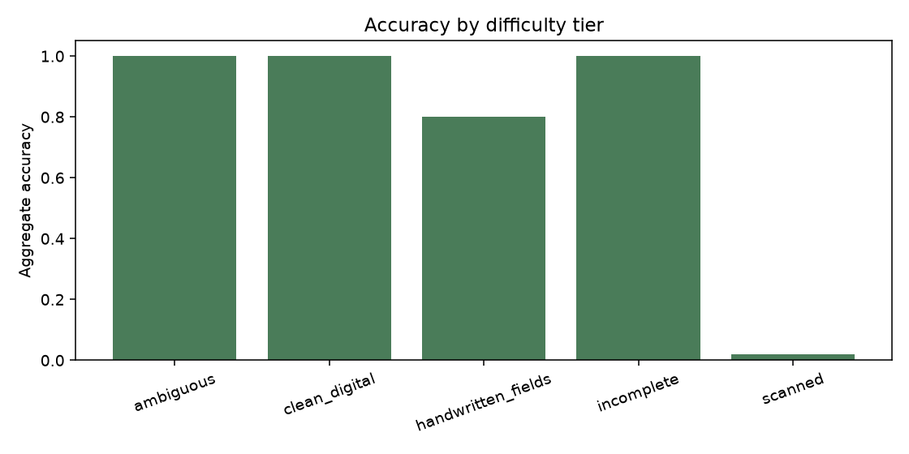
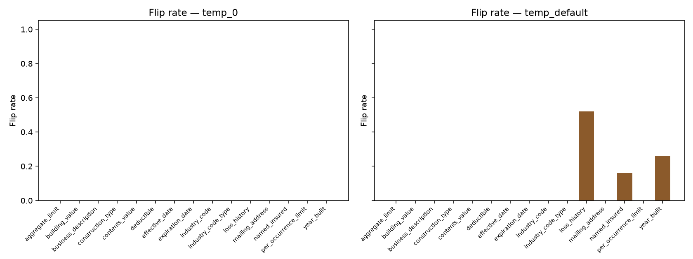
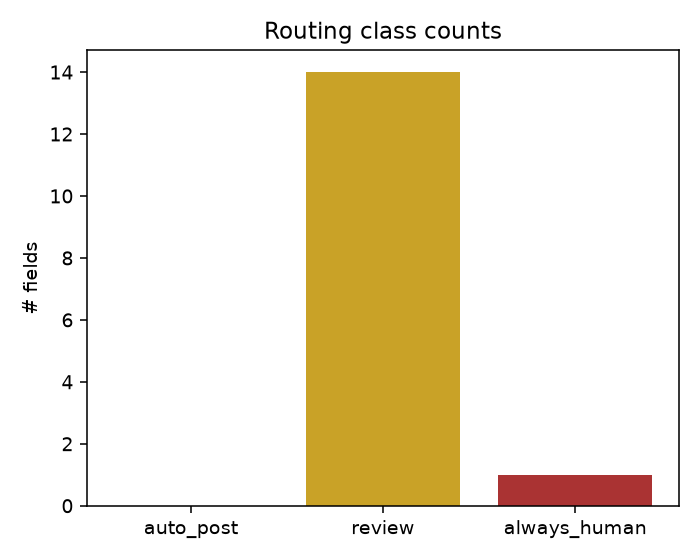

# Submission Extraction Reliability Report

**Synthetic documents only.** No real insurance data or PII was used.

## Headline aggregate (hides variation)

- Headline aggregate accuracy: **0.764** across 50 documents
- Per-field accuracy range: **0.600** … **0.860**
- Provider: `local`
- Total spend: **$0.0000**

## Per-field accuracy

| Field | Accuracy | Correct / Total |
|---|---:|---:|
| aggregate_limit | 0.800 | 40/50 |
| building_value | 0.800 | 40/50 |
| business_description | 0.800 | 40/50 |
| construction_type | 0.800 | 40/50 |
| contents_value | 0.800 | 40/50 |
| deductible | 0.600 | 30/50 |
| effective_date | 0.800 | 40/50 |
| expiration_date | 0.800 | 40/50 |
| industry_code | 0.800 | 40/50 |
| industry_code_type | 0.800 | 40/50 |
| loss_history | 0.860 | 43/50 |
| mailing_address | 0.800 | 40/50 |
| named_insured | 0.600 | 30/50 |
| per_occurrence_limit | 0.800 | 40/50 |
| year_built | 0.600 | 30/50 |

## Accuracy by difficulty tier

| Tier | Aggregate accuracy | N |
|---|---:|---:|
| ambiguous | 1.000 | 10 |
| clean_digital | 1.000 | 10 |
| handwritten_fields | 0.800 | 10 |
| incomplete | 1.000 | 10 |
| scanned | 0.020 | 10 |

## Stability (flip rates) — conditions reported separately

### temp_0

Single-run mean accuracy: 0.764; majority-vote accuracy: 0.764 (N docs=50)

| Field | Flip rate |
|---|---:|
| aggregate_limit | 0.000 |
| building_value | 0.000 |
| business_description | 0.000 |
| construction_type | 0.000 |
| contents_value | 0.000 |
| deductible | 0.000 |
| effective_date | 0.000 |
| expiration_date | 0.000 |
| industry_code | 0.000 |
| industry_code_type | 0.000 |
| loss_history | 0.000 |
| mailing_address | 0.000 |
| named_insured | 0.000 |
| per_occurrence_limit | 0.000 |
| year_built | 0.000 |

### temp_default

Single-run mean accuracy: 0.747; majority-vote accuracy: 0.764 (N docs=50)

| Field | Flip rate |
|---|---:|
| aggregate_limit | 0.000 |
| building_value | 0.000 |
| business_description | 0.000 |
| construction_type | 0.000 |
| contents_value | 0.000 |
| deductible | 0.000 |
| effective_date | 0.000 |
| expiration_date | 0.000 |
| industry_code | 0.000 |
| industry_code_type | 0.000 |
| loss_history | 0.520 |
| mailing_address | 0.000 |
| named_insured | 0.160 |
| per_occurrence_limit | 0.000 |
| year_built | 0.260 |

## Majority-vote comparison

| Condition | Single-run accuracy | Majority-vote accuracy | Delta |
|---|---:|---:|---:|
| temp_0 | 0.764 | 0.764 | +0.000 |
| temp_default | 0.747 | 0.764 | +0.017 |

## Routing policy

| Field | Accuracy | Flip (temp_0) | Flip (temp_default) | Flip used | Class |
|---|---:|---:|---:|---:|---|
| aggregate_limit | 0.800 | 0.000 | 0.000 | 0.000 | review |
| building_value | 0.800 | 0.000 | 0.000 | 0.000 | review |
| business_description | 0.800 | 0.000 | 0.000 | 0.000 | review |
| construction_type | 0.800 | 0.000 | 0.000 | 0.000 | review |
| contents_value | 0.800 | 0.000 | 0.000 | 0.000 | review |
| deductible | 0.600 | 0.000 | 0.000 | 0.000 | review |
| effective_date | 0.800 | 0.000 | 0.000 | 0.000 | review |
| expiration_date | 0.800 | 0.000 | 0.000 | 0.000 | review |
| industry_code | 0.800 | 0.000 | 0.000 | 0.000 | review |
| industry_code_type | 0.800 | 0.000 | 0.000 | 0.000 | review |
| loss_history | 0.860 | 0.000 | 0.520 | 0.520 | review |
| mailing_address | 0.800 | 0.000 | 0.000 | 0.000 | review |
| named_insured | 0.600 | 0.000 | 0.160 | 0.160 | review |
| per_occurrence_limit | 0.800 | 0.000 | 0.000 | 0.000 | review |
| year_built | 0.600 | 0.000 | 0.260 | 0.260 | always_human |

Full machine-readable policy: `runs/report/routing_policy.json`

